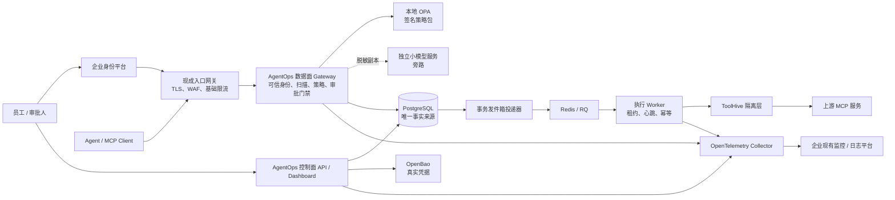

# AgentOps Guard 企业化路线图

日期：2026-09-04

代码基线：`5c3d394d629db0ccf367b34b931b5db8031b29bf`

目标：把当前“功能完整的安全网关原型”推进为“可在一个企业或部门内承载真实 Agent/MCP 流量的受控生产候选”。

## 1. 结论先行

当前最需要补的不是更多扫描规则，而是四条决定系统会不会越权或重复执行的主链：

1. Gateway 必须知道真实调用者是谁，不能相信请求正文自报的项目和 Agent。
2. 审批必须绑定当时看到的工具版本、参数、用户要求和策略版本，任何变化都要重新审批。
3. 审批通过后必须能在进程重启后继续，同时只能有一个执行者领取执行权。
4. PostgreSQL 与 Redis 之间不能再靠“先写一个、再写另一个”碰运气，数据库必须是唯一事实来源。

完成这四项后，再做小模型隔离与校准、真实在线评测、审计防篡改、容量和故障演练。这里的“企业级”不是代码更多，而是能拿出证据证明：

- 调用者伪造身份也不能越权；
- 参数或工具被偷换后旧审批不能使用；
- 重试、超时和宕机不会盲目重复付款、删除或改权限；
- 凭据不进入模型、消息、URL、工具参数、普通日志或链路数据；
- 依赖故障时系统会按事先约定的规则暂停、拒绝或降级；
- 在约定流量下可扩容、可恢复、可追查。

## 2. 产品定位和边界

AgentOps Guard 的定位保持为 **Agent/MCP 专用安全治理层**，部署在企业已有的入口网关之后。

本项目负责：

- 将可信身份、原始用户要求、工具动作和目标做确定性对齐；
- 扫描外部内容、工具说明、参数和结果；
- 执行策略、暂停高风险动作、人工审批和安全恢复；
- 通过 `credential_ref` 使用模型不可见的凭据；
- 固定工具、策略和模型版本，记录可复核的审计证据；
- 隔离高风险 MCP 服务并完成安全评测。

本项目不重复实现：

- TLS 终止、WAF、通用负载均衡和边缘限流：交给 Envoy、Kong、APISIX 或云网关；
- 员工账号、单点登录和多因素认证：交给 Entra ID、Okta、Keycloak 等身份平台；
- PostgreSQL、Redis 和对象存储本身的高可用：优先使用托管服务或成熟运维方案；
- 通用消息平台：当前规模先用 PostgreSQL 事务发件箱加 Redis/RQ，不引入 Kafka；
- 通用模型平台：当前只有一个小分类器，先拆成独立服务；多模型和 GPU 调度出现后再评估 KServe；
- 自研策略语言、密钥库和 MCP 协议解析器：继续使用 OPA、OpenBao 和官方 MCP SDK。

不在第一阶段承诺：

- 公司唯一核心网关；
- 任意外部工具都能做到严格“恰好执行一次”；
- 多地域双活、计费系统、完整合规认证或客户自管密钥；
- 小模型直接批准、放行或覆盖硬规则。

## 3. 已核实的当前基线

### 已完成且应保留

- FastAPI 控制面、独立 MCP Gateway、Redis/RQ Worker、PostgreSQL/SQLite、Dashboard 和 Helm/Compose。
- 标准 MCP 上游连接，以及工具、资源、提示的前后置扫描。
- 服务端保存原始用户要求，写入、发送、删除、付款和权限变更走确定性动作对齐与审批。
- `credential_ref`、可信 DeepSeek 出站传输、Fernet/OpenBao 适配器。
- ToolHive 可选容器隔离。
- 规则优先、OPA 只能收紧不能放宽的策略合并。
- 小语义模型固定权重和摘要，默认关闭或旁路，不参与处置。
- 固定公开数据回归、脱敏审计和 OpenTelemetry 代码基础。

### 2026-09-04 本轮实施后的状态

| 能力 | 当前代码事实 | 尚未完成 |
| --- | --- | --- |
| Gateway 身份 | 标准 MCP 入口和六条兼容路由均已鉴权；项目和 Agent 来自 API Key、会话或已验签工作负载令牌；读和调用权限分离 | 未接真实企业身份平台和入口网关 |
| 工具版本 | 工具说明、参数结构、来源、服务配置和扫描结果形成不可变版本；数据库禁止改写历史版本 | 还需发布签名和跨环境来源证明 |
| 策略版本 | 内置策略号、策略包版本、OPA 包版本写入每次决策快照 | 还需签名策略包的集中发布流程 |
| 审批恢复 | 审批绑定身份、运行、工具版本、参数摘要、策略快照和到期时间；批准后精确重提可一次领取 | 为避免保存敏感原始参数，尚未实现服务端无人值守自动重放 |
| DB/Redis 一致性 | Job 与 PostgreSQL 发件箱同事务提交；固定消息号投递；Worker 原子领取、每分钟续租、最多三次恢复后进入 `dead`；管理端已有失败任务页、对账指标和保留原记录的受控人工重投；真实 PostgreSQL/Redis/RQ 下已验证 Worker 执行中终止、租约恢复、相同事件重复投递不重复入队和 Redis 整体停止后恢复；PostgreSQL 16 备份已在独立空库恢复；本地两节点同步流复制完成受控提升；三节点 Patroni/Kubernetes 完成强制主库故障和 DCS 定向分区、自动选主、固定 Service 切换、最多一个真实可写主库、原主以备库重加和业务状态复核 | 仍需目标环境持久卷、硬件看门狗/节点隔离、任意主机分区、TLS、跨可用区、生产数据规模恢复时间、长时间 Redis 积压和容量演练 |
| 审计 | 每个项目有数据库内哈希链和完整性检查接口；OpenBao Transit 以不可导出 Ed25519 密钥签署链头，公开封条可独立保留和验签；PostgreSQL 拒绝更新、删除和清空审计历史及封条 | 仍需企业独立只追加存储定期拉取封条，防止表所有者或数据库管理员停用保护后整体回滚或删除 |
| OPA 策略 | 官方 `1.8.0` 镜像按摘要真实运行，覆盖容器隔离、Rego、HTTP 决策、只收紧合并和故障转审批；固定 SHA-256 的官方 `1.20.1` 二进制已通过远程签名 Bundle v1→v2 热更新、Status 回传、篡改拒绝、发布端故障保留和恢复 | 仍需签名验证的 `1.20.1` 生产镜像、TLS/工作负载身份、企业密钥托管、过期/回滚和多副本一致性，并在真实 Kubernetes 网络策略实现上验证 |
| 遥测 | 固定归档和二进制摘要的官方 Collector Contrib `0.160.0` 已真实接收 OTLP；下游关闭时写入磁盘队列，Collector 终止/重启后向本地后端补发，动态私密标记未进入 trace；固定 Cosign `3.1.2` 已按精确官方身份和签发方验证归档并拒绝单字节篡改 | 当前签名证据属于发布归档，不是官方生产容器；仍缺生产 PV、企业后端展示/搜索/告警、队列填满和目标负载 |
| 模型隔离 | 小模型保持旁路并已拆为独立离线服务；Gateway 只发送本地脱敏的 1,024 字符以内文本，且不挂载权重；高风险事件只能把后续改写升级为审批；Helm 有资源和网络限制 | 尚未在真实 Kubernetes 中做 OOM、重启和网络隔离验证，分数也未完成新盲集校准 |
| 容量 | 每个 MCP 服务已有可配置并发上限和超时拒绝；多副本模式用 Redis 原子租约跨进程共享上限，真实双 Gateway HTTP 竞争、释放和进程崩溃恢复已通过；标准上下游使用官方 MCP Python SDK `2.1.1`，且冻结客户端 `1.9.4`、`1.29.1`、`2.1.1` 三个协议锚点已通过主链 | 还没有长任务、2 倍峰值 30 分钟和完整依赖故障演练 |

完整实现证据和残余风险见 `specs/enterprise-implementation-status-v1.md`。原路线图下方各
Task 保留为目标清单，不能因为本轮组件测试通过就视为整张路线图全部完成。

已有 `specs/agentops-guard-engineering-plan.md` 记录了早期工程化工作，本文件只规划尚未完成的企业化部分，不重复已经落地的功能。

## 4. 目标架构

关键取舍：

- PostgreSQL 保存审批、执行请求、发件箱、消费记录和审计，是唯一可恢复的事实来源。
- Redis 只负责加速投递，Redis 丢消息不能导致数据库任务消失。
- OPA 靠近 Gateway 运行，控制面只负责发布签名策略包；数据面不依赖一个中央 OPA 单点。
- 小模型不在 Gateway 进程内，也不在同步放行链上；硬规则和授权策略不依赖模型可用性。
- Agent 只持有 `credential_ref`。只有受信 API/执行组件能在授权后解析并向固定目标注入认证字段。

## 5. 上线前先确认的量化门槛

下列数字是第一版建议值，不是当前已经达到的事实。Sprint 0 必须结合实际流量确认后冻结。

### 安全门槛

- 跨组织、跨项目、伪造 Agent、伪造角色和过期令牌的负向用例全部拒绝。
- 高风险审批必须绑定调用者、项目、工具版本、规范化参数摘要、原始要求版本、策略版本和到期时间。
- 同一执行请求 10 个并发领取者中只能有 1 个成功。
- 工具、参数、身份或策略任一变化后，旧审批使用率为 0。
- 植入专用测试密钥后，模型输入、消息、URL、工具参数、日志、追踪、错误页和普通数据库字段中的明文命中数为 0。
- OPA、扫描器、模型或 OpenBao 故障时，高风险写操作不得自动放行。

### 可靠性门槛

- 在“数据库已提交但 Redis 不可用”“Worker 执行前/中/后被杀死”“重复投递”等故障下，没有任务静默丢失。
- 支持上游幂等键的工具不得出现重复副作用。
- 不支持幂等且结果未知的付款、删除、改权限操作进入 `outcome_unknown`，禁止自动重试，必须查询上游或人工核对。
- PostgreSQL 主库切换后审批、执行请求和审计可继续读取；备份必须真实恢复一次。

### 性能和可用性门槛

- 初始目标：单地域月可用性 99.9%。
- 在约定峰值 2 倍流量持续 30 分钟时，AgentOps 自身错误率低于 0.1%，无审计缺口。
- 不含上游工具耗时、且小模型不在同步链路时，建议把 Gateway 新增耗时控制在 p95 100ms、p99 250ms 内。
- 最终数值以 Sprint 0 的真实基线和业务峰值为准；如果目标变化，必须先改验收合同再改实现。

### 检测和业务可用性门槛

- 继续分别报告规则、小模型和并集，不把静态检出率写成攻击阻断率。
- 新盲测必须使用未参与规则、模型或阈值调整的数据，并按语言、来源和攻击类型切片。
- 模型参与“升级到审批”前，建议正常难例误报率不高于 1%，且高风险攻击召回率不低于 90%；最终门槛由业务误放和误审成本确定。
- 完整 Agent 评测中，设计范围内的未授权高风险工具实际执行数为 0。
- 正常任务完成率相对无网关基线下降不超过 2 个百分点。

## 6. 实施顺序

建议由 3 人小组用 12–16 周完成受控生产候选；单人开发更现实的是 16–20 周。生产称号还需要至少一个受限租户的灰度运行证据，不能在代码合并当天宣布完成。

### Sprint 0：冻结边界和基线（第 1 周）

目标：先写清楚要保护什么、故障时怎么做、性能要达到多少，避免后面边做边改标准。

#### Task 0.1：建立威胁模型和数据流图

- 位置：新增 `specs/threat-model-v1.md`。
- 内容：列出外部调用者、员工、Agent、Gateway、审批人、Worker、OPA、OpenBao、ToolHive 和上游 MCP 的信任边界。
- 必须覆盖：身份伪造、工具说明污染、参数偷换、审批竞争、凭据外发、上游超时、重复副作用、审计删除。
- 验收：每个威胁都有预防控制、发现方式、故障动作和残余风险。
- 验证：由代码中的实际入口反查，不能只画理想架构。

#### Task 0.2：冻结服务目标和故障规则

- 位置：新增 `specs/production-slo-v1.md` 和 `specs/failure-mode-matrix-v1.md`。
- 内容：确认流量峰值、延迟、错误率、可用性、恢复时间、数据恢复点和各依赖故障时的动作。
- 验收：付款、删除、发送和改权限必须分别写出“可重试、不可重试、结果未知”的处理方式。
- 验证：评审表中不得出现“失败时默认继续”这类含糊语句。

#### Task 0.3：保留现状性能和正确性基线

- 位置：扩展 `scripts/benchmark_gateway_comparison.py`，新增不含正文的基线报告格式。
- 内容：记录当前规则、OPA、数据库和上游调用各阶段耗时，以及当前公开评测结果。
- 验收：报告固定代码提交、配置、机器、数据摘要和样本数。
- 验证：结果能在相同环境复跑；静态、子系统和端到端指标分栏展示。

本 Sprint 演示：给出一条发送工具调用，从身份、原始要求、策略、审批到上游的完整数据流和失败点。

### Sprint 1：关闭 Gateway 身份漏洞（第 2–3 周，P0）

目标：任何授权判断都只使用经过验证的身份。

#### Task 1.1：立即把现有项目 API Key 接到 Gateway

- 位置：`gateway/app.py`、`backend/auth.py`、Gateway 契约测试。
- 内容：Gateway 路由复用现有 API Key 校验；项目从 `AuthContext` 取得。
- 行为：正文或查询中的 `project_id`、`agentId` 与可信上下文不一致时直接拒绝；它们不得覆盖可信值。
- 验收：匿名请求为 401；跨项目请求为 403/404；审计 actor 来自认证上下文。
- 验证：增加匿名、伪造项目、伪造 Agent、吊销 Key、过期 Key 和权限不足测试。

#### Task 1.2：拆分人员身份、Agent 身份和执行身份

- 位置：`backend/security/context.py`、身份 schema、Alembic migration。
- 内容：可信主体至少包含 organization、project、subject、subject_type、environment、scopes 和 credential_id。
- 验收：审批人的人员身份不能直接冒充 Agent；Worker 的执行身份不能调用控制面管理员接口。
- 验证：角色/权限矩阵逐项测试，跨租户资源一律不可见。

#### Task 1.3：接企业 OIDC 和短期工作负载令牌

- 位置：新增令牌验证适配层、Helm 配置和部署文档。
- 内容：复用企业 IdP；校验签发方、接收方、签名、有效期和权限范围。Kubernetes 内优先使用指定 audience 的短期 ServiceAccount Token。
- 约束：令牌只放请求头，不进入 URL、日志和模型；不转发客户端令牌给上游。
- 验收：密钥轮换不重启服务；删掉 Pod/身份后令牌按平台语义失效。
- 验证：错误 issuer、audience、签名、scope、过期时间全部拒绝。

#### Task 1.4：让通用入口网关承担通用能力

- 位置：Helm values 和 `docs/deployment.md`。
- 内容：给出 Envoy/Kong/云网关的参考边界，只允许入口网关访问 AgentOps 数据面；配置 TLS、请求大小和基础限流。
- 验收：Gateway Service 默认不直接暴露公网；可信转发头只接受来自受信入口的连接。
- 验证：绕过入口直接访问失败，伪造转发头不能生成可信身份。

本 Sprint 演示：同一请求只改正文中的项目、Agent 或角色，全部无法越权；合法短期令牌可以完成只读调用。

### Sprint 2：固定工具、策略和调用内容（第 4–5 周，P0）

目标：审批人看到的内容和最后执行的内容必须完全相同。

#### Task 2.1：增加不可变工具版本

- 位置：`backend/models.py`、Alembic migration、`services/mcp_refresh.py`。
- 内容：新增 `McpToolRevision`，保存规范化工具说明、输入/输出结构、注解、来源服务、镜像摘要、扫描器版本、风险结果和内容摘要。
- 行为：刷新只新增版本并更新“当前版本指针”，不修改旧版本。
- 验收：相同内容重复刷新复用同一摘要；任何字段变化都生成新版本。
- 验证：数据库约束禁止修改已发布版本，迁移和并发刷新测试通过。

#### Task 2.2：建立不可变策略快照

- 位置：现有 `PolicyPack` revision、OPA 适配层和 `PolicyDecision`。
- 内容：每次决策保存内置规则版本、项目策略包版本和 OPA 实际激活的 bundle revision。
- 验收：能够解释“当时为什么批准或拒绝”；策略更新不改变历史决策。
- 验证：旧策略和新策略对同一输入的回放结果可并排比较。

#### Task 2.3：新增执行请求封套

- 位置：新增 `ExecutionRequest` 模型、schema 和服务。
- 内容：服务端生成调用 ID，固定可信主体、工具版本、规范化参数摘要、原始要求引用、策略快照、风险级别、到期时间和客户端幂等键。
- 约束：数据库默认只保存脱敏参数引用；需要原文时按现有内容权限和保留策略处理。
- 验收：相同规范化输入有稳定摘要；不允许客户端直接提交服务端摘要。
- 验证：字段顺序、Unicode 归一化和数字表示测试固定规范化合同。

#### Task 2.4：执行前检查版本漂移

- 位置：Gateway 调用门禁。
- 内容：真正调用上游前重新确认工具当前摘要和已批准摘要一致。
- 验收：工具说明、结构、注解、镜像或策略变化都会把请求转为 `stale`，不执行上游。
- 验证：在审批后修改每一种绑定字段，旧审批均失败。

本 Sprint 演示：审批后把工具描述从“读取”改为“删除”，旧审批立即失效，上游调用次数为 0。

### Sprint 3：完成可恢复、一次领取的审批执行（第 6–8 周，P0）

目标：批准后可以自动、安全地继续；重启和并发不会产生第二个执行者。

#### Task 3.1：建立明确状态机

- 位置：`ExecutionRequest`、`ApprovalRequest`、状态枚举和 Alembic migration。
- 状态：`waiting_approval → approved → execution_claimed → executing → succeeded/failed/outcome_unknown`，另含 `denied/expired/stale/cancelled`。
- 验收：每个状态只允许文档中列出的下一步；非法跳转快速失败并审计。
- 验证：状态迁移表单元测试覆盖全部允许和拒绝路径。

#### Task 3.2：生成一次性批准凭证

- 位置：审批服务。
- 内容：批准记录绑定执行请求、批准人、批准时间、到期时间和一次性随机号；不向模型暴露可消费凭证。
- 验收：批准、拒绝、过期和取消均不可被覆盖；同一审批的第二次消费失败。
- 验证：两个审批人同时操作、重复提交和过期边界测试。

#### Task 3.3：原子领取执行权

- 位置：执行服务和 PostgreSQL repository。
- 内容：使用行锁或条件更新让 Worker 从 `approved` 原子进入 `execution_claimed`，记录 owner 和 lease。
- 验收：10 个并发 Worker 只有 1 个领取成功。
- 验证：真实 PostgreSQL 并发测试，SQLite 仅保留单进程开发语义。

#### Task 3.4：批准后自动恢复

- 位置：审批路由、事务发件箱和 Worker。
- 内容：批准事务同时写执行状态和待投递事件；Worker 领取后从数据库中的固定封套执行，不接受 Agent 重新提交参数。
- 验收：Gateway 或 API 重启后仍能恢复；Agent 不需要重放原始危险调用。
- 验证：批准前后分别杀死 API、Gateway 和 Worker，状态最终可解释。

#### Task 3.5：按副作用类型处理重试

- 位置：工具版本字段、执行器和策略。
- 分类：只读可重试、带上游幂等键的写入可重试、不可幂等写入不可自动重试。
- 验收：上游返回前断线时，不可幂等操作进入 `outcome_unknown`；只有查询确认未执行后才能重新发起。
- 验证：模拟“上游已执行但响应丢失”，系统不得盲目第二次调用。

本 Sprint 演示：审批后重启全部无状态服务，任务仍会继续；并发 10 次领取只产生 1 次可观察的上游调用。

### Sprint 4：修复任务投递和恢复（第 9–10 周，P0）

目标：消除 PostgreSQL 与 Redis 双写裂缝。

#### Task 4.1：增加 PostgreSQL 事务发件箱

- 位置：新增 `OutboxEvent` 模型、migration 和 repository。
- 内容：创建 Job、执行请求或审批状态时，在同一数据库事务写入待投递事件。
- 验收：业务事务回滚时没有消息；业务事务提交后，即使 Redis 不可用，消息仍留在数据库。
- 验证：在提交前、提交后、Redis 调用前后注入失败。

#### Task 4.2：实现幂等投递器

- 位置：独立 dispatcher 进程/CLI、Compose/Helm。
- 内容：按稳定事件 ID 投递 RQ，成功后记录投递时间；重复投递使用同一 ID。
- 验收：Dispatcher 多副本不会丢消息或生成不同业务任务。
- 验证：两个 Dispatcher 并发、Redis 重启和重复发送测试。

#### Task 4.3：增加消费记录、租约和心跳

- 位置：`BackgroundJob`、`ProcessedEvent`、Worker。
- 内容：原子领取、lease owner、lease expiry、heartbeat、attempt limit 和最后错误码。
- 验收：Worker 死亡后过期任务可回收；已完成事件再次到达时直接返回原结果。
- 验证：执行前、执行中和落库后杀死 Worker。

#### Task 4.4：增加失败队列和对账

- 位置：Worker、运维 API、Dashboard。
- 内容：超过重试次数进入失败队列；对账任务查找长时间 pending、过期 lease、无 RQ 任务和结果未知执行。
- 验收：没有静默卡死；人工重放必须填写原因并写审计。
- 验证：制造每类异常记录，控制台能找到并按权限处理。

本 Sprint 演示：关闭 Redis 后提交任务，再恢复 Redis；任务最终执行且业务记录没有丢失。重复投递同一事件不会重复副作用。

### Sprint 5：生产化策略和语义模型（第 11–12 周，P1）

目标：策略可发布、可追溯；模型故障不拖垮 Gateway。

#### Task 5.1：把 OPA 改为本地执行、集中发布

- 位置：Helm、OPA 配置、策略发布服务。
- 内容：每个 Gateway Pod 附近运行 OPA；控制面发布带签名 bundle；启用 bundle 持久化和 Status API。
- 验收：新 bundle 验签成功才激活；失败时继续使用上一版并告警；决策记录含 active revision。
- 验证：真实 OPA 解析 Rego、错误 bundle、错误签名、OPA 重启和断网测试。

#### Task 5.2：拆出独立语义分类服务

- 位置：新增内部 model service，Gateway 只保留受限客户端。
- 内容：复用现有已审查的权重加载和脱敏逻辑；固定镜像与模型摘要；设置输入长度、并发、内存、超时和熔断。
- 约束：只接收脱敏后的外部文本，不接收凭据引用、URL、工具参数或完整策略上下文；不记录正文。
- 验收：模型 OOM、超时和重启不影响硬规则；Gateway 不再挂载模型权重。
- 验证：契约测试、故障测试和不含正文的指标测试。

#### Task 5.3：分开原始分数、校准可信度和动作门槛

- 位置：风险 schema、离线校准脚本、评测报告。
- 内容：规则保留确定性严重级别；模型保留 raw score；用独立校准集生成 calibrated confidence；策略使用单独 action threshold。
- 验收：报告不再把规则 `0.8` 与模型 `0.8` 当成相同含义。
- 验证：按中文/英文、来源和动作代价分别报告校准误差、召回和误报。

#### Task 5.4：继续保持模型旁路

- 位置：配置门禁和发布检查。
- 内容：在新盲测和线上正常难例达标前，模型只能增加内部观察信号，不得批准、放行或推翻硬规则。
- 验收：生产配置无法绕过发布门禁直接启用 enforce。
- 验证：配置、Helm 和运行时三层测试。

本 Sprint 演示：模型服务被停止后，高风险调用仍按硬规则暂停；重新上线的新模型可与旧模型旁路对比，不影响真实动作。

### Sprint 6：凭据、工具隔离和供应链（第 13–14 周，P1）

目标：把已经实测的本地 OpenBao/ToolHive 能力升级为生产配置。

#### Task 6.1：OpenBao 使用生产工作负载认证

- 位置：OpenBao 策略、Helm values 和凭据适配器。
- 内容：API Pod 用短期工作负载身份登录；取消长期静态 Token；每个服务只获所需路径。
- 验收：Gateway、Worker、Dashboard 和模型服务都没有解密权限；撤销 API 身份后读取立即失败。
- 验证：身份轮换、权限越界和 OpenBao 不可用测试。
- 当前进度：生产路径已改为官方 OpenBao Proxy。API 与审计出口不持有 OpenBao 令牌，各自 Proxy
  从只读文件取得 RoleID 和一次性包装令牌，负责解包、登录、续期和强制注入，并使用独立策略。
  本地真实 OpenBao 已通过包装令牌轮换、重新登录、越权拒绝和删除身份后拒绝。企业集群中的
  Secret 同步控制器、TLS 和撤销告警仍需实跑，因此本任务只算代码与子系统完成。

#### Task 6.2：完成 OpenBao 高可用和恢复

- 位置：独立部署手册，不把 OpenBao 硬塞进本项目 Chart。
- 内容：使用企业现有 OpenBao，或至少 3 节点 Raft、TLS、自动解封、审计输出和快照备份；关键生产环境按官方建议评估 5 节点。
- 验收：主节点故障可切换；从快照在隔离环境真实恢复并验证 credential_ref 生命周期。
- 验证：封印、节点丢失、证书轮换和备份恢复演练。

#### Task 6.3：固定 ToolHive 权限模板

- 位置：`deploy/toolhive/`、MCP server 风险配置。
- 内容：默认无网络、无宿主目录、非特权；按工具显式开放只读目录和目标域名/端口；完整网络白名单只在 bridge 网络使用。
- 验收：权限声明和容器真实状态一致；host 网络不允许假装已启用白名单隔离。
- 验证：读取未授权目录、访问未授权网络、提权和逃逸负向测试。
- 当前进度：已新增版本化无权限模板、强制来源校验的启动器和 Docker 实际状态对账脚本；本地
  无网络、无挂载、无设备、非特权、丢弃全部 capabilities 已通过。域名/端口白名单和容器逃逸
  测试仍待目标运行环境完成。

#### Task 6.4：固定并验证交付物来源

- 位置：CI、Helm values、发布清单。
- 内容：容器按 digest 固定，生成 SBOM，扫描依赖和镜像，使用 Cosign/Sigstore 验签；模型、策略和工具镜像都记录来源摘要。
- 验收：未签名或摘要漂移的生产镜像拒绝部署。
- 验证：用错误摘要和错误签名执行发布门禁测试。
- 当前进度：Python 服务和 Dashboard 已拆为独立生产镜像，基础镜像与 Helm 部署镜像都要求按
  SHA-256 摘要固定，并通过缺摘要、错格式和遗漏 OPA 摘要的负向测试。GitHub Actions、uv、Python
  和审计工具版本已固定；代码检出不保留访问凭据。直接复用 uv 与 npm 生成 Python 96 组件、
  Dashboard 131 组件的 CycloneDX 1.5 清单，并已进入本地发布验收。Google OSV 已对当前两份
  锁文件完成真实在线复扫并返回 0 个受影响包，生产依赖 npm 审计也为 0；聚合证据绑定锁文件
  摘要并由发布检查复核。ToolHive 严格模式已拒绝缺少来源资料的镜像；GitHub 托管工作流、
  WSL `pip-audit`、容器完整构建、镜像扫描与已签名镜像的正向验签仍未完成。

本 Sprint 演示：Agent 只有 credential_ref；测试密钥只在受信 API 进程最后一跳出现。隔离工具无法访问未授权网络和目录。

### Sprint 7：真实观测、在线评测和故障发布门禁（第 15–16 周，P1）

目标：用运行证据决定能否进入受控生产，而不是凭功能列表宣布完成。

#### Task 7.1：接通真实 OpenTelemetry 后端

- 位置：`deploy/otel-collector.yaml`、Helm 和监控平台。
- 内容：Collector 启用批处理、内存保护、重试和必要的磁盘队列；向企业现有 Prometheus/Tempo/Loki 或同类平台导出。
- 指标：p50/p95/p99、策略耗时、模型超时、审批等待、队列积压、租约回收、失败队列、审计缺口和 OPA revision。
- 验收：Collector 重启不影响数据面；关键审计不依赖遥测管道。
- 验证：真实 Collector 导出和看板/告警截图，确认没有正文或密钥字段。
- 当前本地证据：官方 `0.160.0` 主机进程已完成 OTLP、持久队列、下游故障和进程重启补发；这只
  清除“Collector 从未真实运行”的缺口，不清除企业后端、生产容器/PV、签名、告警或容量门槛。

#### Task 7.2：提高审计抗篡改能力

- 位置：AuditLog migration、数据库权限和外部日志导出。
- 内容：应用账号只能追加审计；每条记录带前一条摘要或按批次生成签名检查点；周期性导出到只写存储或企业 SIEM。
- 验收：修改或删除历史记录能被检测；审批、执行和上游结果由同一 request/trace/execution ID 串联。
- 验证：篡改演练和完整性核对。
- 当前进度：PostgreSQL 已拒绝更新、删除和清空历史审计及签名封条；独立出口复用 Boto3，导出前
  核对数据库链、签名和 OpenBao 公钥来源，再以 SHA-256、条件创建、版本号和 `COMPLIANCE`
  保留期写入 S3 Object Lock，并写后读取同一版本复核。SDK 请求级和 Helm 最小权限渲染已通过；
  本地真实 S3 兼容服务还证明管理员无法删除精确版本或缩短保留期、重复条件写不会新增版本。
  该停止维护的 MinIO 社区二进制只作协议夹具；企业对象锁桶、TLS/工作负载身份、多节点耐久性与
  整库回滚告警仍未验证。

#### Task 7.3：建立完整 Agent 安全评测

- 位置：新增 `tests/system/` 与 `specs/online-eval-v1.md`。
- 流程：原始用户要求 → 外部恶意内容 → Agent 决策 → 工具调用 → 策略/审批 → 恢复或阻断 → 上游副作用。
- 指标：攻击成功率、未授权工具执行率、正常任务完成率、误审批率、人工等待和额外延迟。
- 数据：固定公开集、未见攻击集、中文正常难例和受控真实流程分开报告；线上只留脱敏引用和汇总值。
- 验收：静态扫描、策略判断、审批门禁、真实执行和业务可用性有各自指标。
- 验证：结果固定代码、模型、策略、工具和数据版本，可复跑。

#### Task 7.4：完成容量和故障矩阵

- 位置：`tests/load/`、`tests/faults/` 和发布报告。
- 场景：重复请求、审批竞争、Worker 被杀、Redis 中断、PostgreSQL 切换、OPA/模型/OpenBao/Collector 故障、上游执行后响应超时、工具版本漂移和滚动升级。
- 验收：满足第 5 节冻结后的流量、延迟、错误率、审计和恢复门槛。
- 验证：每个故障场景都有时间线、期望动作、实际结果和残余风险。

#### Task 7.5：补齐 MCP 标准入口和版本矩阵

- 位置：Gateway transport、官方 MCP SDK、协议合同测试。
- 内容：先建立当前 v1 与正式版协议兼容矩阵，再迁移到官方 Python SDK v2；为下游提供标准 MCP HTTP 入口，旧 `/mcp/*` 仅作为过渡兼容层。
- 约束：不手写第二套 JSON-RPC；MCP OAuth/OIDC 校验 audience、scope 和每请求授权；客户端令牌不得转发上游。
- 验收：支持的 MCP 版本、能力和授权方式有自动合同测试；不支持的能力明确拒绝。
- 验证：新旧官方客户端、认证失败、scope 提升、工具列表变化和长任务状态标识测试。

本 Sprint 演示：在约定峰值 2 倍流量下依次中断依赖，系统不越权、不丢审计、不盲目重复副作用，并能在看板中定位原因。

## 7. 发布和灰度策略

### 阶段 A：只读影子流量

- 复制真实请求的脱敏元数据，不调用有副作用工具。
- 比较策略决定、扫描结果、额外延迟和资源消耗。
- 模型保持旁路；发现差异只记录，不影响现网。

### 阶段 B：低风险只读工具

- 只开放经过固定版本和权限审核的只读工具。
- 每租户设置并发、超时和熔断；观察至少一个完整业务周期。
- 任何身份、审计或恢复异常立即停止扩大流量。

### 阶段 C：可撤销写操作

- 只开放支持幂等键、查询结果和补偿操作的写工具。
- 高风险仍逐事件审批；比较审批等待和正常任务完成率。

### 阶段 D：不可逆高风险操作

- 付款、生产权限和不可逆删除需要额外专项评审。
- 默认双人审批、短有效期、明确目标、金额/范围上限和上游对账。
- 上游无法提供幂等或状态查询时，不自动恢复和重试。

## 8. 每个提交都要保留的证据

每项企业化能力都要在 `artifacts/verification/` 生成不含秘密和正文的报告，并在发布说明中登记：

- Git 提交、依赖锁和容器摘要；
- MCP、工具、策略、模型和数据集版本；
- 测试命令、环境、样本数和耗时；
- 成功、失败、跳过和未验证项；
- 静态测试、子系统测试、端到端测试和真实故障演练的类别；
- 残余风险和下次复核日期。

本地固定入口为 `uv run python scripts/run_release_verification.py`。它只保存代码、依赖锁和既有
基准报告的摘要，以及每项固定检查的通过/失败和耗时；不保存命令输出、环境变量值、请求正文或
模型正文。检查失败后立即停止后续检查，但仍生成失败报告。报告中的外部门槛必须保持未通过，
不能因本地检查全绿而自动清除。

对外和简历描述只能使用已经真实跑通的证据。例如：

- 可以写“实现可信工作负载身份和跨项目隔离”，前提是负向测试与实际部署均通过；
- 可以写“审批后可恢复并通过并发、重启和重复投递验证”，前提是 Sprint 3–4 门槛通过；
- 可以写“在约定峰值 2 倍流量下通过故障演练”，前提是报告保存了环境和结果；
- LLMail 的 92.80% 仍只能描述为固定静态外部内容扫描并集检出率，不能写成端到端阻断率。

## 9. 暂不做的 P2 项目

只有明确客户或监管需求时才启动：

- 多地域双活和跨地域一致性；
- HSM、客户自管密钥和动态短期第三方凭据；
- 完整 WORM 法律留存、数据驻留和监管认证；
- 多组织 SaaS 自助控制面、计费和成本分摊；
- 大规模跨集群 SPIFFE/SPIRE；
- 自研通用工作流引擎或消息平台。

## 10. 最终完成定义

本计划完成后，准确说法应是：

> AgentOps Guard 是部署在企业通用入口网关之后的 Agent/MCP 专用安全治理层。它使用可信身份和不可变版本固定每次工具调用，以可恢复人工审批和幂等执行控制高风险副作用，通过 OpenBao 与 credential_ref 隔离凭据，并用可追溯策略、隔离运行时、端到端评测及容量/故障演练证明受控生产能力。

若只有本地代码和子系统证据，没有目标企业环境中的 OIDC/OPA/OpenBao/Collector、数据库自动切换
与隔离、生产规模备份恢复和完整 Agent 流程验证，则仍应称为“企业级架构原型”，不能称为
“生产可用”。

## 11. 采用的一手实践依据

- MCP 2026-07-28 授权规范：<https://modelcontextprotocol.io/specification/2026-07-28/basic/authorization>
- MCP 工具安全要求：<https://modelcontextprotocol.io/specification/2026-07-28/server/tools>
- MCP Python SDK v2 说明：<https://github.com/modelcontextprotocol/python-sdk/blob/main/docs/whats-new.md>
- Kubernetes 短期 ServiceAccount Token：<https://kubernetes.io/docs/concepts/security/service-accounts/>
- AWS Transactional Outbox：<https://docs.aws.amazon.com/en_en/prescriptive-guidance/latest/cloud-design-patterns/transactional-outbox.html>
- OPA 管理架构与签名策略包：<https://www.openpolicyagent.org/docs/management-introduction>、<https://www.openpolicyagent.org/docs/management-bundles>
- OpenBao Kubernetes 生产部署：<https://openbao.org/docs/platform/k8s/helm/run/>
- OpenTelemetry Collector 部署：<https://opentelemetry.io/docs/collector/deploy/>
- ToolHive 权限和网络隔离：<https://github.com/stacklok/toolhive/blob/main/docs/arch/05-runconfig-and-permissions.md>
- OWASP AI Agent Security Cheat Sheet：<https://cheatsheetseries.owasp.org/cheatsheets/AI_Agent_Security_Cheat_Sheet.html>
