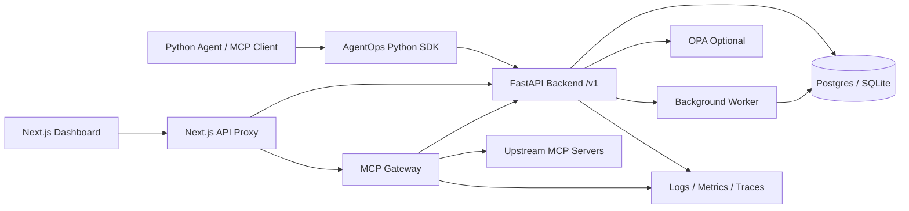
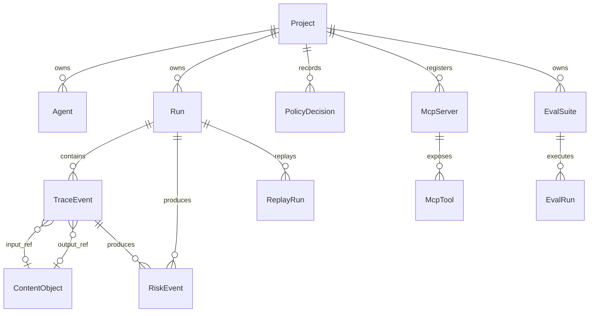
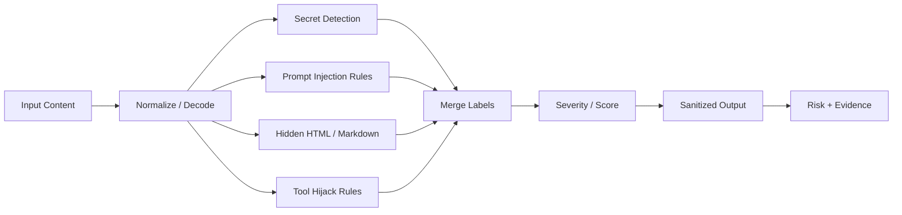
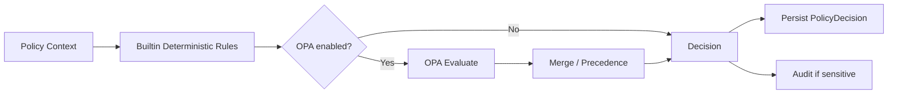
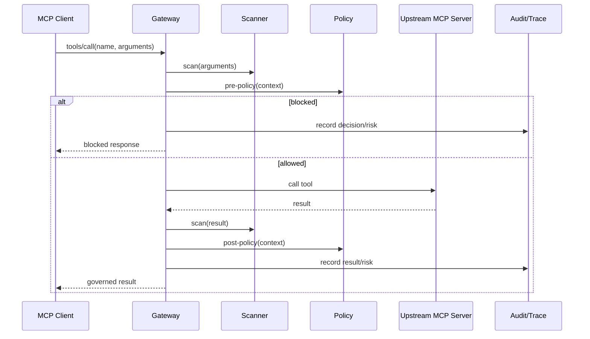
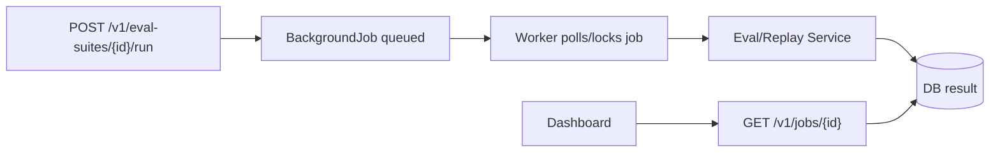

# AgentOps Guard 软件设计文档

**生成日期**: 2026-05-08  
**设计目标**: 将当前可运行 v1 scaffold 演进为模块清晰、契约稳定、安全可控、可观测、可部署的 AgentOps 工程系统  
**技术基线**: Python 3.12、uv、FastAPI、SQLAlchemy、Alembic、Postgres/SQLite、Next.js、Playwright、Vitest

## 1. 总体架构



系统采用“控制平面 + 数据平面”分层：

- 控制平面: Backend API、Dashboard、Policy/Scanner 配置、MCP registry、Eval/Replay 管理。
- 数据平面: SDK trace ingestion、MCP Gateway tool/resource/prompt 调用治理、异步评测/回放执行。
- 存储平面: Postgres 为生产主存储，SQLite 为 local-first 开发体验，对象存储预留大内容和导出文件。
- 可观测平面: 结构化日志、Prometheus metrics、OpenTelemetry traces。

## 2. 模块划分

### 2.1 Backend API

建议将当前 `routes.py` 拆分为以下 bounded context：

```text
src/agentops_guard/backend/
  api/
    router.py
    deps.py
    routes_health.py
    routes_projects.py
    routes_runs.py
    routes_events.py
    routes_content.py
    routes_scanner.py
    routes_policy.py
    routes_risks.py
    routes_replay.py
    routes_eval.py
    routes_mcp.py
    routes_jobs.py
    routes_audit.py
  domain/
    models.py
    enums.py
    errors.py
  services/
    trace.py
    content.py
    scanner.py
    policy.py
    replay.py
    eval.py
    mcp_registry.py
    jobs.py
    audit.py
  repositories/
    runs.py
    events.py
    risks.py
    mcp.py
    evals.py
  security/
    api_keys.py
    rbac.py
  observability/
    logging.py
    metrics.py
    tracing.py
```

拆分原则：

- Route 只做 HTTP 解析、鉴权、状态码与 schema 转换。
- Service 承载业务规则和事务边界。
- Repository 封装查询，避免 Dashboard 过滤需求污染路由。
- Domain 定义枚举、错误类型和跨模块对象。
- Security 与 Observability 作为横切能力，不散落在业务代码中。

### 2.2 MCP Gateway

Gateway 应从单文件实现演进为独立运行时模块：

```text
src/agentops_guard/gateway/
  app.py
  router.py
  registry.py
  policy_guard.py
  scanner_guard.py
  transports/
    base.py
    streamable_http.py
    stdio.py
  runtime/
    process_manager.py
    limits.py
    errors.py
```

核心设计：

- `Transport` 抽象统一 list tools、call tool、read resource、get prompt。
- `StdioProcessManager` 管理 MCP stdio 子进程、启动参数、超时、重启和 stderr。
- `PolicyGuard` 在调用前后执行 scanner + policy，并统一输出 `decision`, `risk`, `upstream`。
- `Limits` 统一限制请求体大小、输出大小、调用超时、并发数。

### 2.3 SDK

SDK 需要保持“低侵入、失败不影响业务”的设计：

- `AgentOpsClient`: HTTP 客户端，支持 timeout、retry、batch、flush、close。
- `AgentOpsTracer`: context manager 追踪 run/span。
- `AsyncAgentOpsClient`: 预留异步 Agent 框架。
- `NoopClient`: API 不可用时降级，避免业务失败。
- `BatchExporter`: 后台批量发送事件。

### 2.4 Dashboard

Dashboard 设计为运维控制台，不直接承载安全决策逻辑：

- Server Components 用于首屏聚合数据。
- Client Components 用于交互表单、过滤器、局部刷新。
- Next.js API proxy 作为 BFF，服务端注入 API Key，浏览器不读取后端密钥。
- 所有页面必须支持 loading、empty、error、retry。
- 数据表格统一分页/排序/过滤协议。

## 3. 数据模型设计

### 3.1 当前核心模型



### 3.2 建议新增模型

```text
Organization(id, name, created_at)
User(id, email, display_name, auth_provider, created_at)
Membership(id, org_id, user_id, role, created_at)
ApiKey(id, project_id, name, key_hash, scopes, expires_at, last_used_at, revoked_at)
AuditLog(id, project_id, actor_type, actor_id, action, resource_type, resource_id, before, after, ip, user_agent, created_at)
ApprovalRequest(id, project_id, run_id, event_id, policy_decision_id, status, requested_by, reviewed_by, expires_at)
PolicyBundle(id, project_id, name, version, provider, source, status, created_at)
ScannerRule(id, project_id, name, version, pattern, severity, enabled, created_at)
BackgroundJob(id, project_id, kind, status, payload, result, error, attempts, run_after, started_at, finished_at)
```

### 3.3 Migration 策略

- 开发环境可继续支持 SQLite local-first。
- 生产环境必须通过 Alembic migration 管理 schema。
- 当前 placeholder migration 应替换为真实 initial schema。
- 每次模型变更必须包含 migration、downgrade 或明确不可逆说明。
- CI 增加 `alembic upgrade head` 验证。

## 4. API 设计

### 4.1 API 版本与契约

- 所有稳定接口使用 `/v1` 前缀。
- OpenAPI 作为契约来源，配合 `specs/api-contracts.md` 记录人工可读变更。
- breaking change 只能进入 `/v2` 或通过显式 feature flag 发布。

### 4.2 通用协议

请求要求：

- `X-AgentOps-Api-Key` 或 `Authorization: Bearer <token>`。
- `X-Request-Id` 可选；缺失时服务端生成。
- 写接口必须具备 project scope。

错误响应建议：

```json
{
  "error": {
    "code": "resource_not_found",
    "message": "Run not found",
    "details": {}
  }
}
```

分页协议建议：

```text
GET /v1/runs?project_id=default&limit=50&cursor=...
```

返回：

```json
{
  "items": [],
  "next_cursor": null
}
```

当前接口多返回数组，短期可保持兼容，新增 `page` 参数或新 envelope schema 逐步迁移。

### 4.3 关键 API 分组

| 分组 | 当前状态 | 设计方向 |
| --- | --- | --- |
| System | 已有 status | 增加 healthz/readyz/metrics |
| Runs/Events | 已有 CRUD/ingest/DAG | 增加分页、批量幂等、标准 event kind |
| Content | 已有 read by id | 增加权限、对象存储引用、raw content 审计 |
| Scanner | 已有 scan | 增加规则版本、批量扫描、dry-run |
| Policy | 已有 evaluate/list/reload | 增加 bundle、explain、dry-run、approval |
| Risks | 已有 list/get | 增加状态流转、owner、suppression |
| Replay/Eval | 已有同步执行 | 改为 job 化与历史趋势 |
| MCP | 已有 registry/tools | 增加 refresh job、quarantine、health |
| Audit | 缺失 | 新增所有敏感操作审计 |

## 5. 策略与扫描设计

### 5.1 Scanner Pipeline



设计要求：

- 规则必须输出 `label`, `severity`, `score`, `evidence span`, `reason`。
- 规则版本写入 scan result，便于回归对比。
- Base64/HTML/Markdown 等 decoder 必须限制递归深度和输入大小。
- secret detection 与 prompt injection detection 分离，避免标签语义混乱。

### 5.2 Policy Pipeline



动作优先级建议：

```text
deny > quarantine > require_approval > sandbox > redact > rate_limit > allow
```

策略执行原则：

- 对高风险工具默认 fail-closed。
- 对 OPA 不可用场景应用 `policy_fail_mode`。
- 对策略结果记录 matched policy、reason code、remediation。
- 对人工审批场景创建 ApprovalRequest，而不是只返回 require_approval。

## 6. MCP Gateway 设计

### 6.1 调用流程



### 6.2 运行时隔离

- 每个 stdio server 使用独立进程组。
- 配置启动超时、调用超时、最大输出、最大并发。
- stderr 进入结构化日志，必要时关联 McpServer health。
- 上游异常统一转为 MCP error content，不泄露内部 stack trace。
- 对 external trust level 默认启用更严格扫描和 approval。

## 7. 异步任务设计

当前 Replay/Eval 同步执行适合 demo，不适合生产。建议引入轻量 job 系统：



实现路径：

- 第一阶段使用数据库表 + worker loop，减少依赖。
- 第二阶段接入 Redis/RQ/Celery/Arq 之一。
- Job payload/result 使用 schema version，避免任务升级不兼容。
- 所有任务支持 idempotency key、attempts、run_after、error summary。

## 8. 安全设计

### 8.1 API Key

- 存储 `key_hash`，只在创建时返回明文。
- 支持 scopes：`trace:write`, `runs:read`, `policy:evaluate`, `mcp:admin`, `admin:*`。
- 支持 `expires_at`, `revoked_at`, `last_used_at`。
- 默认开发 key 仅允许 local/dev profile。

### 8.2 RBAC

| 角色 | 权限 |
| --- | --- |
| Admin | 项目、密钥、策略、MCP、审计全权限 |
| Security Reviewer | 查看风险、策略 dry-run、审批请求 |
| Developer | 写 trace、查看本项目 run、运行 eval/replay |
| Read Only | 只读 Dashboard 与导出受限数据 |

### 8.3 内容隐私

- `store_raw_content=false` 是默认安全态。
- raw content 开启、读取、导出都写 AuditLog。
- 大内容通过 object uri 管理，API 返回前做权限与大小判断。
- 脱敏规则可按项目配置，但系统级 secret 规则不可关闭。

## 9. 可观测性设计

### 9.1 日志

结构化日志字段：

```json
{
  "timestamp": "...",
  "level": "info",
  "service": "agentops-api",
  "request_id": "...",
  "project_id": "default",
  "run_id": "run_x",
  "trace_id": "trace_x",
  "event": "policy.evaluate",
  "duration_ms": 12
}
```

### 9.2 Metrics

建议指标：

- `agentops_api_requests_total{route,status}`
- `agentops_trace_events_ingested_total{project_id,event_type}`
- `agentops_policy_decisions_total{action,reason_code}`
- `agentops_scanner_findings_total{label,severity}`
- `agentops_gateway_tool_calls_total{server,tool,status}`
- `agentops_jobs_total{kind,status}`

### 9.3 Tracing

- API request span。
- DB query span。
- Policy/Scanner/Gateway upstream span。
- Eval/Replay job span。

## 10. Dashboard 设计

### 10.1 页面信息架构

| 页面 | 目标 | 关键组件 |
| --- | --- | --- |
| Setup | 验证 API/DB/Gateway 配置 | SetupStatus |
| Overview | 总览运行、风险、成本与健康 | StatCard、RecentRisks |
| Runs | 查找 Agent 执行 | RunsFilter、RunsTable |
| Run Detail | 分析单次执行 | RunDagView、EventInspector、ReplayButton |
| Risks | 风险台账 | RiskFilters、EvidencePanel |
| Scanner | 内容扫描调试 | ScannerForm |
| Policy | 策略调试 | PolicyForm |
| Replay | 回放历史 run | ReplayStudio |
| Evals | 回归评测 | EvalStudio |
| MCP | MCP 注册与测试 | McpManager |

### 10.2 前端数据流

- 读请求优先由 Server Component 调用 BFF。
- 交互请求由 Client Component 调用 `lib/api.ts`。
- BFF 服务端添加 API Key 和后端 URL。
- 错误统一展示 `message + retry`。
- 表格状态通过 query string 保存，便于分享链接。

### 10.3 生产体验补强

- 增加统一 `DataTable`, `EmptyState`, `ErrorState`, `LoadingSkeleton`。
- 增加 react-query 缓存与局部 invalidation。
- 对 Run/Event/Risk 列表增加 cursor pagination。
- 对危险操作增加确认弹窗与审计备注。
- 对内容详情增加权限提示与 raw content 查看审计。

## 11. 部署设计

### 11.1 本地开发

```powershell
uv sync --extra dev
uv run agentops-guard api --reload
uv run agentops-guard gateway --config mcp-gateway.yaml --reload
cd dashboard
npm install
npm run dev
```

### 11.2 Docker Compose

建议增加 dashboard 服务与 migration job：

```text
postgres -> migration -> api
postgres -> migration -> gateway
api/gateway -> dashboard
```

### 11.3 生产环境

- API/Gateway/Dashboard 独立容器。
- Postgres 托管或独立 HA。
- Redis/queue 可选。
- Secret 通过环境变量或 Secret Manager 注入。
- Migration 作为发布前置 job。

## 12. 测试设计

### 12.1 后端

- Unit: scanner、policy、content redaction、DAG、replay/eval service。
- API integration: auth、project isolation、pagination、error envelope。
- DB: migration upgrade/downgrade、Postgres smoke。
- Gateway: mock upstream、stdio fake server、pre/post policy。

### 12.2 SDK

- HTTP success/error path。
- Batch flush/retry/noop。
- Nested span correctness。
- Exception path 不吞异常且记录 failed event。

### 12.3 Dashboard

- Vitest: payload builder、formatters、API helper error handling。
- Component tests: forms、tables、empty/error states。
- Playwright: spec IDs 覆盖 Setup、Scanner、Policy、Replay、Eval、MCP、Risks、Runs。

### 12.4 CI Gate

```powershell
uv run ruff check .
uv run pytest --cov=agentops_guard --cov-fail-under=80
cd dashboard
npm run test
npm run build
npm run test:e2e
```

## 13. 演进路径

### Phase 1: 稳定内核

- 拆分 backend routes。
- 建立真实 Alembic initial migration。
- 增加分页、错误 envelope、request id。
- 加强 API Key 安全与项目隔离。

### Phase 2: 网关生产化

- 实现真实 stdio transport。
- 增加上游超时、输出限制、健康检查。
- 将 Gateway pre/post policy 结构化审计。

### Phase 3: 评测与回放平台化

- 引入 BackgroundJob。
- Eval/Replay 异步化。
- Dashboard 增加历史趋势和失败聚类。

### Phase 4: 可观测与安全运营

- OTel、metrics、结构化日志。
- AuditLog、ApprovalRequest、RBAC。
- PolicyBundle 与 scanner rule version。

### Phase 5: 产品化交付

- Docker Compose 完整栈。
- Helm chart 或部署手册。
- SDK 文档、API changelog、示例 MCP server。

## 14. 关键设计取舍

| 取舍 | 推荐 | 原因 |
| --- | --- | --- |
| SQLite vs Postgres | SQLite 保留开发，生产强制 Postgres | 兼顾上手速度与可靠性 |
| 同步任务 vs 异步任务 | API 同步创建 job，worker 异步执行 | 避免请求阻塞和超时 |
| 规则硬编码 vs 规则配置 | P0 保留内置规则，P1 引入版本化规则 | 保证稳定后再扩展 |
| 单体后端 vs 微服务 | 先模块化单体 | 当前规模无需过早拆服务 |
| OPA 必选 vs 可选 | OPA 可选 provider | 降低本地部署复杂度 |

## 15. 风险与缓解

- 风险: 路由拆分引入行为回归。缓解: 先补 API contract tests，再移动代码。
- 风险: migration 从 `create_all` 迁移到 Alembic 破坏本地数据。缓解: 提供备份与一次性 bootstrap 指南。
- 风险: Gateway stdio 进程泄漏。缓解: 进程组、超时、健康检查、finally cleanup。
- 风险: raw content 合规风险。缓解: 默认关闭、项目级显式开启、读取审计、保留清理。
- 风险: Eval/Replay 异步化增加复杂度。缓解: 先 DB-backed worker，后续再引入队列。
